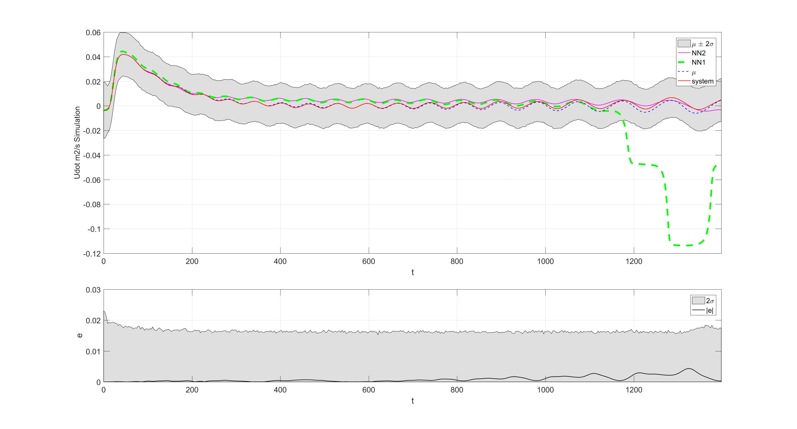
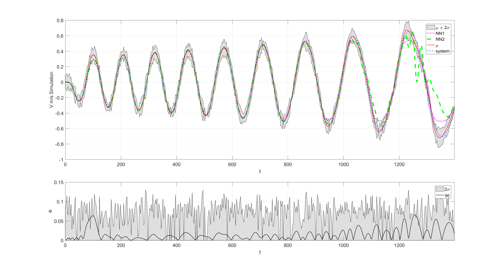
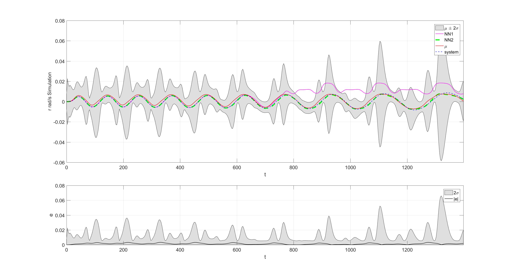
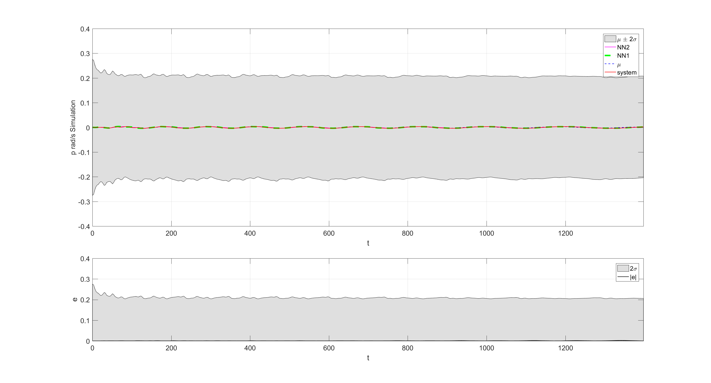

# System indetification of Ship Dynamic System with Multi Output Gaussian Processes

This code is based in the work of Prof. Mauricio A. Alvarez and Prof. Neil D. Lawrence  [SheffieldML](usedhttps://github.com/SheffieldML/multigp) and the work of Prof. Dr. Juš Kocijan. This is an inplmenetation of dynamic system indetification with multi-output Gaussian Processes.+

A Underactuated Ship model was used to generate data for system indetification. The system is a two input , four output system.
A NARX architecture was used for the Multioutput Gaussian Processes as for the comparative Neural Networks.

<center><br>Fig. 8 Prediction from Multi_output GPs by algorithm of Naive Simulation with full data compared to mathematical model, a) controlled surge acceleration, b) induced sway speed, c) controlled yaw speed, and d) induced roll speed </center>

## Getting Started

These instructions will get you a copy of the project up and running on your local machine for development and testing purposes. See deployment for notes on how to deploy the project on a live system.

<center><br> <i>Left</i> First output in the four outputs of the demo. <i>Right</i> Fourth output for the same example. </cent


### Installing

A step by step series of examples that tell you have to get a development env running

Say what the step will be

```
Give the example
```

And repeat

```
until finished
```

End with an example of getting some data out of the system or using it for a little demo

## Running the tests

Explain how to run the automated tests for this system


## Authors

* **Billie Thompson** - *Initial work* - [PurpleBooth](https://github.com/PurpleBooth)

See also the list of [contributors](https://github.com/your/project/contributors) who participated in this project.

