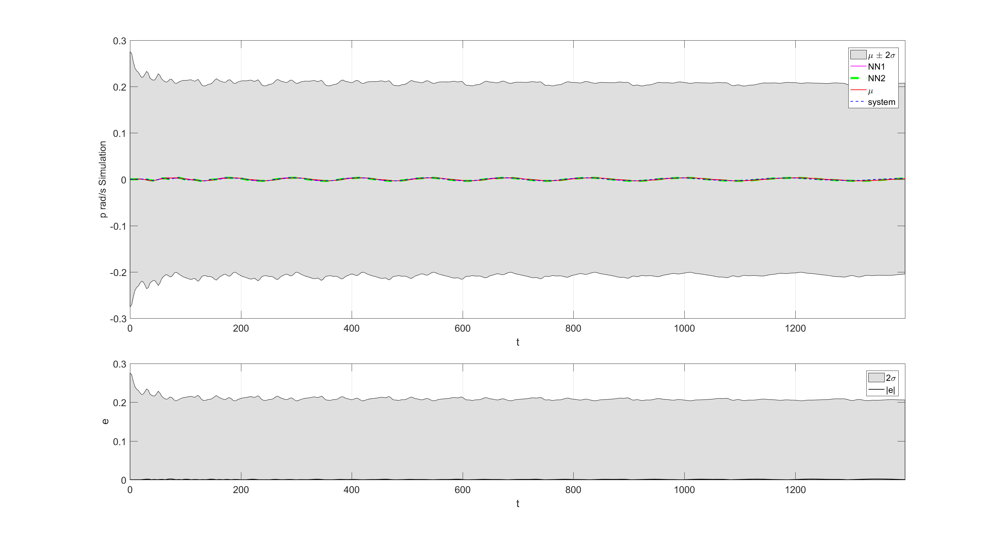

# System indetification of Ship Dynamic System with Multi Output Gaussian Processes

This code is based in the work of Prof. Mauricio A. Alvarez and Prof. Neil D. Lawrence  [SheffieldML](usedhttps://github.com/SheffieldML/multigp) (some modification were made such that Gaussian Processes with dimension greater than 2 can be run) and the work of Prof. Dr. Juš Kocijan. This is an inplementation of dynamic system indetification with multi-output Gaussian Processes.

A Underactuated Ship model was used to generate data for system indetification. The system is a two input , four output system.
A NARX architecture was used for the Multioutput Gaussian Processes as for the comparative Neural Networks.

If you want to cite this work please cite:

 Prediction from Multi_output GPs by algorithm of Naive Simulation with full data compared to mathematical model, a) controlled surge acceleration, b) induced sway speed, c) controlled yaw speed, and d) induced roll speed 

## Getting Started

To run the System idetification, please run the file:

## Author

Wilmer Ariza Ramirez

Australian Maritime College, University of Tasmania, Newnham TAS 7248, Australia

Wilmer.ArizaRamirez@utas.edu.au 

 

